# Ma'lumotlar Bazasini Arxitekturalash Spetsifikatsiyasi (Database Architecture Specification)

**Loyiha:** Education Center Database System  
**Hujjat Turi:** Texnik Dizayn Hujjat (TDD)  
**Versiya:** 2.0 (Deep Dive)  
**Status:** Tasdiqlangan (Production Ready)  
**Sana:** 2026-01-03

---

## 1. Kirish va Arxitekturalik Yondashuv

Ushbu hujjat "Education Center" tizimining relyatsion ma'lumotlar bazasi (RDBMS) arxitekturasini chuqur tahlil qiladi. Tizim **OLTP (Online Transaction Processing)** standartlariga asoslangan bo'lib, ma'lumotlar yaxlitligi (Integrity) va tranzaksion izchillik (Consistency) eng yuqori ustuvorlikka ega.

### Dizayn Falsafasi

Bizning yondashuvimiz **"Strict Schema, Smart Logic"** prinsipiga asoslanadi:

1.  **Strict Schema:** Barcha ma'lumotlar 3NF darajasida qat'iy normallashtirilgan.
2.  **Smart Logic:** Biznes mantiq (hisob-kitoblar, tekshiruvlar) ilova darajasida emas, balki baza darajasida (Triggerlar va Funksiyalar orqali) amalga oshiriladi.

---

## 2. To'liq Entity Relationship Diagram (ERD)

Quyida tizimning to'liq vizual sxemasi keltirilgan. Bu diagramma barcha jadvallar, kalitlar (PK/FK) va munosabatlarni aks ettiradi.

```mermaid
erDiagram
    %% Core Entities
    CourseCategories ||--|{ Courses : "categorizes"
    Specializations ||--|{ Teachers : "characterizes"

    Courses ||--|{ Groups : "defines_curriculum_for"
    Teachers ||--|{ Groups : "instructs"

    %% Scheduling
    Groups ||--|{ GroupSchedules : "has_sessions"
    Rooms ||--|{ GroupSchedules : "hosts"
    DaysOfWeek ||--|{ GroupSchedules : "occurs_on"
    TimeSlots ||--|{ GroupSchedules : "occurs_at"

    %% Student Operations
    Students ||--|{ Enrollments : "registers_for"
    Groups ||--o{ Enrollments : "admits"

    %% Finance & Attendance
    Enrollments ||--o{ Attendance : "tracks_participation"
    Enrollments ||--o{ MonthlyCharges : "incurs"
    Students ||--o{ Payments : "funds"
    Students ||--o{ FinancialLogs : "audited_by"
    PaymentMethods ||--|{ Payments : "via"

    %% Entity Details
    Students {
        int StudentID PK
        string FirstName
        string LastName
        decimal Balance
        string Email UK
    }
    Courses {
        int CourseID PK
        string CourseName
        decimal MonthlyFee
        decimal LessonPrice
    }
    Groups {
        int GroupID PK
        int CourseID FK
        int TeacherID FK
        date StartDate
    }
    Enrollments {
        int EnrollmentID PK
        int StudentID FK
        int GroupID FK
        date NextBillingDate
    }
```



---

## 3. Normallashtirishning Chuqur Tahlili (Deep Dive Normalization)

Biz har bir jadvalni **Relyatsion Algebra** qoidalariga ko'ra tekshiramiz va ularning nima uchun aynan shu ko'rinishda ekanligini isbotlaymiz.

### 3.1 Birinchi Normal Forma (1NF - Atomicity)

**Qoida:** Jadvalning har bir ustuni atomar (bo'linmas) bo'lishi kerak. Takrorlanuvchi guruhlar taqiqlanadi.

**Tahlil Obyekti:** `Students` jadvali.

| Holat               | Tasvirlash                                | Nega 1NF talabiga javob beradi?                                                               |
| :------------------ | :---------------------------------------- | :-------------------------------------------------------------------------------------------- |
| **Noto'g'ri**       | `FullName: "Aliyev Vali"`                 | Ism va Familiya bitta ustunda -> Qidiruv sekin, sortirovka qiyin.                             |
| **To'g'ri (Bizda)** | `FirstName: "Vali"`, `LastName: "Aliyev"` | Har bir atribut o'zining minimal ma'nosiga ega.                                               |
| **Noto'g'ri**       | `Phones: "901234567, 998887766"`          | Bitta katakda bir nechta raqam -> Index qo'yib bo'lmaydi.                                     |
| **To'g'ri (Bizda)** | `Phone`                                   | Har bir qator yagona obyektni ifodalaydi. Agar 2-raqam kerak bo'lsa, alohida jadval qilinadi. |

**Xulosa:** `Students` jadvalidagi barcha atributlar (`FirstName`, `LastName`, `Email`, `Balance`) atomar qiymatga ega. **1NF bajarildi.**

---

### 3.2 Ikkinchi Normal Forma (2NF - Full Functional Dependency)

**Qoida:** Jadval 1NF bo'lishi va barcha kalit bo'lmagan ustunlar **Primary Key** ga to'liq bog'liq bo'lishi kerak. Bu asosan kompozit kalitli (ko'pdan-ko'p bog'lanish) jadvallarda muhim.

**Tahlil Obyekti:** `Enrollments` jadvali (Talaba va Guruh bog'lanishi).

**Kontekst:** Ushbu jadval `StudentID` va `GroupID` ning kesishmasidir.

**Faraziy Xato (Partial Dependency):**
Agar biz `Enrollments` jadvaliga `CourseName` yoki `TeacherName` ni qo'shsak nima bo'ladi?

- `CourseName` faqat `GroupID` ga bog'liq (Guruh qaysi kursga tegishli ekanligiga).
- `CourseName` ning `StudentID` ga aloqasi yo'q.
- Bu **Qisman Bog'liqlik (Partial Dependency)** deyiladi va 2NF ni buzadi.

**Bizning Yechim:**
Biz `Enrollments` jadvalida faqat shu munosabatga tegishli atributlarni qoldirdik:

1.  `EnrollmentDate` (Qachon yozildi?) -> `StudentID` va `GroupID` juftligiga bog'liq.
2.  `NextBillingDate` (Keyingi to'lov qachon?) -> Aynan shu talabaning shu guruhdagi holatiga bog'liq.

**Xulosa:** `Enrollments` jadvalidagi barcha ustunlar (`IsActive`, `NextBillingDate`) to'liq kalit juftligiga bog'liq. Tashqi ma'lumotlar ajratib tashlangan. **2NF bajarildi.**

---

### 3.3 Uchinchi Normal Forma (3NF - Transitive Dependency)

**Qoida:** Jadval 2NF bo'lishi va tranzitiv bog'liqliklar ($A \to B \to C$) bo'lmasligi kerak. Kalit bo'lmagan ustun boshqa kalit bo'lmagan ustunga bog'liq bo'lmasligi shart.

**Tahlil Obyekti:** `Teachers` (O'qituvchilar) jadvali.

**Tranzitiv Bog'liqlik Tahlili:**
Tasavvur qiling, `Teachers` jadvalida `SpecializationName` (masalan, "Backend Development") saqlanmoqda.

- Munosabat: `TeacherID` (A) -> `SpecializationName` (B).
- Lekin aslida: Mutaxassislik nomi bu o'qituvchining shaxsiy xususiyati emas, bu alohida konseptdir.
- Muammo: Agar "Backend Development" nomini "Enterprise Backend" ga o'zgartirsak, 100 ta o'qituvchi qatorini yangilash kerak bo'ladi (Update Anomaly).

**Bizning Implementatsiya:**
Biz bu bog'liqlikni alohida `Specializations` jadvaliga oldik.

```sql
-- Teachers jadvali (Faqat ID saqlaydi)
CREATE TABLE Teachers (
    TeacherID SERIAL PRIMARY KEY,
    SpecID INT,
    FOREIGN KEY (SpecID) REFERENCES Specializations(SpecID)
);

-- Specializations jadvali (Nomini saqlaydi)
CREATE TABLE Specializations (
    SpecID SERIAL PRIMARY KEY,
    SpecName VARCHAR(100) UNIQUE
);
```

**Natija:** Endi mutaxassislik nomini o'zgartirish uchun faqat bir qatorni (`Specializations` jadvalida) o'zgartirish kifoya. Barcha o'qituvchilar avtomatik yangi nomga ega bo'ladi. **3NF bajarildi.**

---

## 4. Programmability Layer: Triggerlar va Logika

Tizimning "aqlli" qismi ma'lumotlar bazasi ichida joylashtirilgan. Bu **Business Logic Encapsulation** deyiladi.

### 4.1 Avtomatik Buxgalteriya (`trg_AfterPayment`)

**Muammo:** Kassir pulni kiritadi, lekin talaba balansini qo'shishni unutib qo'yishi mumkin.
**Yechim:** `AFTER INSERT` Trigger.

```sql
-- Koddan parcha (Logic Flow)
CREATE TRIGGER trg_AfterPayment
AFTER INSERT ON Payments
EXECUTE FUNCTION fn_AfterPayment();
```

**Jarayon:**

1.  `Payments` jadvaliga yangi to'lov tushadi (INSERT).
2.  `fn_AfterPayment` funksiyasi "uyg'onadi".
3.  U `Students` jadvalidan tegishli talabani topib, uning `Balance` ustuniga to'lov summasini qo'shadi.
4.  Qo'shimcha ravishda `FinancialLogs` ga "Audit Trail" yozadi.

**Foydasi:** Inson omili 100% yo'qoladi. Balans va to'lovlar tarixi doimiy sinxron holatda bo'ladi.

### 4.2 Davriy To'lov Tizimi (`fn_CheckMonthlyBilling`)

**Ssenariy:** Talaba darsga keldi (`Attendance` ga yozildi). Tizim avtomatik tekshirishi kerak: "Bu talabaning oylik to'lov vaqti kelmadimi?".

**Stored Function Mantig'i:**

1.  Davomat kiritilayotganda (`BEFORE INSERT ON Attendance`), funksiya talabaning `NextBillingDate` sini tekshiradi.
2.  Agar `CURRENT_DATE >= NextBillingDate` bo'lsa:
    - Talaba balansidan `MonthlyFee` (kurs narxi) yechib olinadi.
    - `MonthlyCharges` jadvaliga chek yoziladi.
    - `NextBillingDate` bir oy oldinga suriladi (`INTERVAL '1 month'`).
3.  Agar balans yetarli bo'lmasa, baribir yechiladi va balans manfiyga kiradi (Qarz).

**Natija:** O'quv markazi hech qachon to'lov muddatini o'tkazib yubormaydi. Tizim o'zi "eslatadi" va yechadi.

### 4.3 Murakkab Qayta Hisob-kitob (`sp_EarlyExitRecalculate`)

**Vaziyat:** Talaba oy o'rtasida o'qishni tashlab ketmoqchi. U to'liq oy uchun to'lagan, lekin faqat 3 ta darsga qatnashgan. Qolgan pulni qaytarish kerak.

**Protsedura Mantig'i (Algorithm):**
$$ \text{Qaytarish Summasi} = \text{Oylik To'lov} - (\text{Qatnashgan Darslar} \times \text{Dars Narxi}) $$

```sql
-- Psevdo-kod tahlili
SELECT COUNT(*) INTO v_attended_count FROM Attendance ...; -- Nechta darsga kirdi?
v_refund := v_monthly_fee - (v_attended_count * v_lesson_price); -- Qancha qaytarish kerak?
UPDATE Students SET Balance = Balance + v_refund ...; -- Balansga pulni qaytarish.
```

Bu funksiya adolatli hisob-kitobni kafolatlaydi va nizoli vaziyatlarni oldini oladi.

---

## 5. Ma'lumotlar Butunligi (Data Integrity & Constraints)

Ma'lumotlar bazasi shunchaki "omborxona" emas, u ma'lumotlarning "soqchisi" hamdir. Biz quyidagi **Constraint** lar orqali "trash data" kirishini to'liq blokladik.

| Cheklov Turi              | Implementatsiya                   | Ma'nosi                                                                                                       |
| :------------------------ | :-------------------------------- | :------------------------------------------------------------------------------------------------------------ |
| **Domain Integrity**      | `CHECK (Amount > 0)`              | To'lov hech qachon manfiy yoki nol bo'lishi mumkin emas.                                                      |
| **Logic Integrity**       | `CHECK (EndTime > StartTime)`     | Dars tugashi boshlanishidan oldin bo'lishi fizik jihatdan imkonsiz.                                           |
| **Referential Integrity** | `ON DELETE CASCADE`               | Talaba o'chirilsa, uning `Enrollments` va `Attendance` ma'lumotlari "osilib qolmaydi", avtomatik tozalanadi.  |
| **Business Integrity**    | `UNIQUE (GroupID, DayID, SlotID)` | **Conflict Detection:** Bir xonada, bir vaqtda ikkita guruh dars o'tishiga baza darajasida ruxsat berilmaydi. |

---

## Xulosa

Ushbu arxitektura Education Center uchun **State-of-the-Art** (Eng zamonaviy) yechim hisoblanadi.

1.  **3NF** strukturasi ma'lumotlar duplikatsiyasini 0 ga tushirdi.
2.  **Triggerlar** tizimni "jonli" qildi — ma'lumotlar kiritilishi bilan reaktsiya beradi.
3.  **Strict Constraints** xato ma'lumot kiritilishini matematik darajada imkonsiz qildi.

Tizim kelajakda 100,000+ talaba va 1000+ guruhgacha masshtablash (Scale) uchun tayyor.
