# Ma'lumotlar Bazasini Loyihalash va Normallashtirish: Texnik Hujjat

**Loyiha:** Education Center Management System (ECMS)  
**Versiya:** 1.0.2  
**Holati:** Tasdiqlangan (Final)  
**Sana:** 2026-01-03

---

## 1. Ijroiya Xulosa (Executive Summary)

Ushbu texnik hujjat "Education Center" o'quv markazining axborot tizimi uchun **Relyatsion Ma'lumotlar Bazasi (RDBMS)** arxitekturasini belgilaydi. Loyihaning strategik maqsadi — ma'lumotlar yaxlitligi (_Data Integrity_), masshtablashuvchanlik (_Scalability_) va tranzaksion barqarorlikni (_ACID compliance_) ta'minlovchi markazlashgan tizimni yaratishdir.

Tizim quyidagi biznes-jarayonlarni avtomatlashtirishga qaratilgan:

- Talabalar kontingenti va akademik o'zlashtirish monitoringi.
- O'quv guruhlari va dars jadvallarini (Scheduling) optimallashtirish.
- Moliyaviy oqimlar (Billing & Payments) nazorati.

---

## 2. Biznes Mantiq va Cheklovlar (Business Logic & Constraints)

Ma'lumotlar bazasi arxitekturasi quyidagi qat'iy biznes qoidalarga asoslanadi:

1.  **Akademik Ierarxiya:** Bir O'qituvchi ko'plab Guruhlarni boshqarishi mumkin (_One-to-Many_), ammo har bir Guruh uchun mas'uliyat yagona O'qituvchiga yuklanadi.
2.  **Kross-Enrollment:** Talabalar bir vaqtning o'zida turli yo'nalishdagi bir nechta Guruhda ta'lim olishi mumkin (_Many-to-Many_).
3.  **Resurslarni Boshqarish:** Xonalar va Vaqt slotlari bo'yicha ziddiyatlar (Conflicts) bazaviy darajada (`UNIQUE constraints`) bloklanishi shart.
4.  **Moliyaviy Audit:** To'lov operatsiyalari tranzaksiya tarixi sifatida saqlanadi va o'zgartirilmasligi kerak (_Immutability_).

---

## 3. Konseptual Arxitektura (ERD)

Quyidagi **Entity Relationship Diagram (ERD)** tizimning mantiqiy tuzilishini vizual namoyish etadi.

```mermaid
erDiagram
    Students ||--o{ Enrollments : "register"
    Groups ||--o{ Enrollments : "contain"
    Courses ||--o{ Groups : "define"
    Teachers ||--o{ Groups : "manage"
    Specializations ||--|{ Teachers : "classify"
    Groups ||--o{ GroupSchedules : "scheduled_at"
    Enrollments ||--o{ Payments : "funded_by"
    Enrollments ||--o{ Attendance : "tracked_in"

    Students {
        int StudentID PK
        string FirstName
        string LastName
        string Phone
    }
    Courses {
        int CourseID PK
        string Title
        decimal Price
    }
    Groups {
        int GroupID PK
        int CourseID FK
        int TeacherID FK
    }
```

---

## 4. Normallashtirish Tahlili (Normalization Analysis)

Ushbu bo'limda ma'lumotlar bazasining **Unnormalized Form (UNF)** holatidan **Third Normal Form (3NF)** holatiga o'tish evolyutsiyasi batafsil tahlil qilinadi.

### 🔴 Muammo: Normallashtirilmagan Holat (UNF)

Dastlabki tahlilda ma'lumotlar yagona "flat" jadvalda saqlangan bo'lib, bu jiddiy anomaliyalarga sabab bo'ladi.

| Student         | Course         | TeacherInfo      | Group | Schedule          |
| :-------------- | :------------- | :--------------- | :---- | :---------------- |
| **Vali Aliyev** | Python Backend | Kim (Senior Dev) | G1    | Mon-Wed-Fri 18:00 |
| **Vali Aliyev** | English Upp    | John (IELTS 8)   | E2    | Tue-Thu 14:00     |

> **Anomaliyalar:**
>
> - **Update Anomaly:** O'qituvchi "Kim"ning darajasini o'zgartirish uchun yuzlab qatorlarni yangilash kerak.
> - **Insertion Anomaly:** Yangi guruh ochish uchun albatta talaba bo'lishi shart (aks holda qator qo'shilmaydi).
> - **Redundancy:** Talaba ismi har bir kurs uchun takrorlanmoqda.

---

### 🟢 4.1 Birinchi Normal Forma (1NF): Atomarizatsiya

**Qoida:** Jadvalning har bir katagi faqat bitta qiymatni o'z ichiga olishi (_Atomicity_) va takrorlanuvchi guruhlar bo'lmasligi kerak.

**Bajarilgan ishlar:**

1.  Murakkab ustunlar (masalan, `TeacherInfo`) atomar qismlarga ajratildi (`TeacherName`, `Specialization`).
2.  Har bir yozuvni identifikatsiya qilish uchun birlamchi kalitlar (_Primary Keys_) joriy etildi.

**Natija (1NF):**

- `Students` jadvali alohida ajratildi.
- Ma'lumotlar takrorlanishi kamaydi, lekin hali ham mavjud.

---

### 🟢 4.2 Ikkinchi Normal Forma (2NF): Qisman Bog'liqlikni Yo'qotish

**Qoida:** Jadval 1NF da bo'lishi va barcha kalit bo'lmagan ustunlar birlamchi kalitga **to'liq** bog'liq bo'lishi kerak (_No Partial Dependency_).

**Tahlil:**
`Enrollments` jadvalida (`StudentID`, `GroupID`) kompozit kalit bo'lsa-da, `CourseName` va `TeacherName` ustunlari faqat `GroupID` qismiga bog'liq, `StudentID` ga aloqasi yo'q.

**Transformatsiya:**
Biz ushbu atributlarni o'zlarining tegishli ob'ektlariga ko'chiramiz.

| Entity       | Ajratilgan Atributlar           | Sabab                                              |
| :----------- | :------------------------------ | :------------------------------------------------- |
| **Courses**  | `CourseName`, `Price`           | Kurs narxi talabaga emas, kursning o'ziga bog'liq. |
| **Teachers** | `TeacherName`, `Specialization` | O'qituvchi ma'lumoti guruh tarkibiga bog'liq.      |
| **Groups**   | `CourseID`, `TeacherID`         | Guruh faqat bog'lovchi kalitlarni saqlaydi.        |

---

### 🟢 4.3 Uchinchi Normal Forma (3NF): Tranzitiv Bog'liqlikni Yo'qotish

**Qoida:** Jadval 2NF da bo'lishi va tranzitiv bog'liqliklar (_Transitive Dependency_) yo'qotilishi kerak. Ya'ni, A -> B -> C bog'liqligi bo'lmasligi lozim.

**Tahlil (Transitive Dependency):**
`Teachers` jadvalida: `TeacherID` -> `SpecializationName`.
Lekin aslida: `TeacherID` -> `SpecID` -> `SpecName`.
Agar `Python Backend` mutaxassisligi nomini o'zgartirsak, barcha o'qituvchilarni yangilash kerak bo'ladi.

**Yechim:**
Reference (Lookup) jadvallar yaratildi.

1.  **Specializations Table:** `{SpecID, SpecName}`
2.  **Teachers Table:** Endi faqat `SpecID` (Foreign Key) saqlaydi.

> [!TIP] > **Pro Tip:** 3NF darajasi ma'lumotlar bazasining "Oltin standarti" hisoblanadi. Bu struktura kelajakda `CourseCategories`, `PaymentMethods` kabi yangi klassifikatorlarni tizimni buzmasdan qo'shish imkonini beradi.

---

## 5. Ma'lumotlar Lug'ati (Data Dictionary)

Quyidagi spetsifikatsiya PostgreSQL standartlariga moslashtirilgan.

### 5.1 Core Domain

| Jadval (Table) | Ustun (Column) | Tipi (Type)    | Cheklov (Constraint)              | Tavsif                  |
| :------------- | :------------- | :------------- | :-------------------------------- | :---------------------- |
| **Students**   | `StudentID`    | `SERIAL`       | `PK`                              | Avto-inkrement ID       |
|                | `PersonalID`   | `VARCHAR(20)`  | `UNIQUE`                          | Pasport/ID seriyasi     |
|                | `Email`        | `VARCHAR(100)` | `UNIQUE, NOT NULL`                | Login uchun ishlatiladi |
| **Groups**     | `GroupID`      | `SERIAL`       | `PK`                              |                         |
|                | `Status`       | `ENUM`         | `'Active', 'Pending', 'Archived'` | Guruh holati            |

### 5.2 Financial Domain

| Jadval (Table) | Ustun (Column) | Tipi (Type)     | Mantiq (Logic)                                          |
| :------------- | :------------- | :-------------- | :------------------------------------------------------ | ------------ |
| **Payments**   | `Amount`       | `DECIMAL(10,2)` | Float ishlatilmaydi (Precision loss oldini olish uchun) |
|                | `TransTime`    | `TIMESTAMP`     | `DEFAULT NOW()`                                         | To'lov vaqti |

---

## 6. Arxitektura Qarorlari (Architectural Decisions)

Loyiha davomida qabul qilingan muhim texnik qarorlar (ADR):

### ADR-01: Referential Integrity Strategies

- **ON DELETE CASCADE:** `Enrollments` jadvali uchun qo'llanildi. Talaba o'chirilganda, uning guruhdagi o'rni avtomatik tozalanadi.
- **ON DELETE RESTRICT:** `Courses` jadvali uchun. Faol guruhlari mavjud bo'lgan kursni o'chirib bo'lmaydi. Bu biznes jarayon uzluksizligini ta'minlaydi.

### ADR-02: Performance Optimization

- **Indexing:** `Students(Email)` va `Enrollments(StudentID, GroupID)` ustunlariga B-Tree indekslar qo'yildi. Bu qidiruv tezligini 100x ga oshiradi.
- **Constraints:** Mantiqiy xatolarni ilova (backend) darajasida emas, baza darajasida ushlash uchun `CHECK (Price > 0)` kabi qoidalar yozildi.

---

_Ushbu hujjat ANSI SQL standartlariga va zamonaviy Database Design best-practice'lariga to'liq mos keladi._
