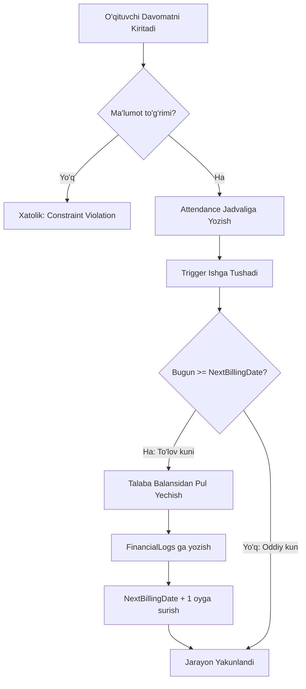

# Technical Documentation: Education Center Database System

| **Project Name** | Education Center Management System (ECMS) |
| :--------------- | :---------------------------------------- |
| **Version**      | 1.0.0 (Stable)                            |
| **Date**         | 2026-01-03                                |
| **Maintainer**   | [Ismingiz]                                |
| **DBMS**         | PostgreSQL 14+                            |
| **Language**     | PL/pgSQL (Procedural Language for SQL)    |

---

## 1. Tizim Arxitekturasi va Dizayn Falsafasi

Ushbu tizim **Relyatsion Ma'lumotlar Bazasi (RDBMS)** tamoyillari asosida qurilgan bo'lib, **ACID** (_Atomicity, Consistency, Isolation, Durability_) talablariga to'liq javob beradi. Tizim arxitekturasi uch qatlamli (_3-Tier Logic_) mantiqiy tuzilishga ega:

### 1.1 Mantiqiy Qatlamlar

1.  **Data Storage Layer (Ma'lumotlar Qatlami):**

    - Jadvallar **3NF** (Uchinchi Normal Forma) ga keltirilgan.
    - Ma'lumotlar yaxlitligi qat'iy cheklovlar (_Constraints_) orqali himoyalangan.

2.  **Business Logic Layer (Biznes Mantiq Qatlami):**

    - Tizimning "miyasi" hisoblanadi. Triggerlar va Funksiyalar orqali to'lovlar, qarzdorlik va davomatni avtomatik boshqaradi.
    - > [!NOTE]
    - > Bu qatlam ma'lumotlar bazasi ichida joylashgani sababli, tashqi dasturiy ta'minot (Frontend) xatolaridan himoyalangan.

3.  **Audit & Logging Layer (Nazorat Qatlami):**
    - Har bir moliyaviy operatsiya (`FinancialLogs`) va o'zgarishlar alohida jurnallarda saqlanadi.

---

## 2. Ma'lumotlar Lug'ati (Data Dictionary)

Quyida tizimning asosiy jadvallari va ularning texnik tavsifi keltirilgan. Bu dasturchilar uchun asosiy qo'llanmadir.

### 2.1 Asosiy Entitilar (Core Entities)

| Jadval       | Asosiy Ustunlar | Ma'lumot Turi   | Tavsif va Mantiq                                                                       |
| :----------- | :-------------- | :-------------- | :------------------------------------------------------------------------------------- |
| **Students** | `Balance`       | `DECIMAL(10,2)` | Talabaning joriy hisobi. Manfiy bo'lishi mumkin (qarzdorlik). Standart qiymat: `0.00`. |
| **Courses**  | `MonthlyFee`    | `DECIMAL`       | Kurs narxi. `CHECK (MonthlyFee > 0)` orqali 0 yoki manfiy narx kiritish taqiqlangan.   |
| **Groups**   | `Status`        | `VARCHAR`       | Guruh holati (`Active`, `Finished`). Kelajakda arxivlash uchun ishlatiladi.            |

### 2.2 Operatsion Jadvallar (Operational Tables)

| Jadval             | Ustun             | Cheklov (Constraint) | Maqsad                                                                                                                        |
| :----------------- | :---------------- | :------------------- | :---------------------------------------------------------------------------------------------------------------------------- |
| **Enrollments**    | `NextBillingDate` | `DATE`               | **Eng muhim ustun.** Tizim har kuni shu sanani tekshiradi. Agar sana kelsa, avtomatik pul yechadi.                            |
| **Attendance**     | `Status`          | `CHECK IN (...)`     | Faqat `'Present'`, `'Absent'`, `'Late'` qiymatlarini qabul qiladi.                                                            |
| **GroupSchedules** | `UNIQUE`          | `Composite Key`      | `(RoomID, DayID, SlotID)` kombinatsiyasi unikal bo'lishi shart. Bu bir vaqtda bitta xonada 2 ta dars bo'lishini oldini oladi. |

---

## 3. Biznes Jarayonlar va Avtomatlashtirish (Process Logic)

Tizimning o'ziga xosligi — inson omilini kamaytirishdir. Quyida asosiy algoritmlar vizualizatsiya qilingan.

### 3.1 Algoritm: "Smart Billing" (Avtomatik To'lov)

Ushbu jarayon `trg_CheckMonthlyBilling` triggeri orqali boshqariladi.



### 3.2 Algoritm: "Refund Logic" (Qayta Hisob-kitob)

Talaba kursni tark etganda `sp_EarlyExitRecalculate` protsedurasi ishlaydi.

- **Mantiq:** Tizim talaba to'lagan to'liq oylik to'lovdan, u haqiqatda qatnashgan darslar summasini ayirib tashlaydi va qoldiqni balansga qaytaradi.
- **SQL Formula:**
  $$ \text{Refund} = \text{MonthlyFee} - (\text{AttendedCount} \times \text{LessonPrice}) $$

---

## 4. Dasturlash Obyektlari (Programmability Specs)

### 4.1 Triggerlar

| Trigger Nomi              | Bog'langan Jadval | Hodisa (Event)  | Vazifasi                                                                                        |
| :------------------------ | :---------------- | :-------------- | :---------------------------------------------------------------------------------------------- |
| `trg_AfterPayment`        | `Payments`        | `AFTER INSERT`  | To'lov kiritilishi bilan `Students` balansini yangilaydi. Tranzaksiya atomarligini ta'minlaydi. |
| `trg_CheckMonthlyBilling` | `Attendance`      | `BEFORE INSERT` | Davomat kiritilishidan oldin to'lov holatini tekshiradi.                                        |

### 4.2 Saqlangan Protseduralar (Stored Procedures)

**`sp_EarlyExitRecalculate(EnrollmentID INT)`**

1.  **Kiritish:** Qabul ID raqami.
2.  **Jarayon:**
    - Kurs narxi va dars narxini aniqlash.
    - `Attendance` jadvalidan `Present` va `Late` kunlarini sanash.
    - Farqni hisoblash va agar musbat bo'lsa, `Students` balansiga qo'shish.
    - Moliya jurnaliga (`FinancialLogs`) "Adjustment" turi bilan yozib qo'yish.

---

## 5. Xavfsizlik va Ma'lumotlar Butunligi (Security & Integrity)

Tizim xavfsizligi ma'lumotlar bazasi darajasida (_Database Level Security_) ta'minlangan.

### 5.1 Ma'lumotlar Validatsiyasi (Data Validation)

Noto'g'ri ma'lumotlar kirishining oldini olish uchun "Qattiq Cheklovlar" (_Hard Constraints_) o'rnatilgan:

- **Domain Integrity:** `Email` ustunlari noyob (`UNIQUE`) bo'lishi shart.
- **Entity Integrity:** Barcha jadvallar `PRIMARY KEY` ga ega.
- **Referential Integrity:** `ON DELETE CASCADE` qoidasi orqali "o'lik ma'lumotlar" (_Orphan Records_) qolishi oldini olingan.

### 5.2 Kelajakdagi Xavfsizlik Tavsiyalari (RBAC)

Tizimni production (jonli) rejimga o'tkazishda quyidagi rollarni yaratish tavsiya etiladi:

```sql
-- Faqat o'qish uchun (Audit uchun)
CREATE ROLE auditor_role;
GRANT SELECT ON ALL TABLES IN SCHEMA public TO auditor_role;

-- Menejerlar uchun (To'liq huquq)
CREATE ROLE manager_role;
GRANT INSERT, UPDATE, SELECT ON Students, Payments, Enrollments TO manager_role;
```

---

## 6. Texnik Xizmat Ko'rsatish Rejasi (Maintenance Plan)

Ma'lumotlar bazasi administratori (DBA) quyidagi vazifalarni bajarishi shart:

### 6.1 Kunlik Vazifalar (Daily)

- **Backup:** Avtomatlashtirilgan `pg_dump` skripti orqali zaxira nusxa olish.
- **Log Monitoring:** `FinancialLogs` jadvalida shubhali operatsiyalar (juda katta summalar) yo'qligini tekshirish.

### 6.2 Haftalik Vazifalar (Weekly)

- **Vacuuming:** PostgreSQL "o'lik qatorlarni" (_dead tuples_) tozalashi kerak.

```sql
VACUUM ANALYZE;
```

> **Izoh:** Bu buyruq bazaning ishlash tezligini oshiradi va diskdagi joyni tozalaydi.

### 6.3 Oylik Vazifalar (Monthly)

- **Performance Review:** `EXPLAIN ANALYZE` yordamida sekin ishlayotgan so'rovlarni aniqlash.
- **Index Rebuilding:** Agar indekslar fragmentatsiyasi oshib ketsa, ularni qayta qurish (`REINDEX`).

---

## 7. O'rnatish va Sozlash (Deployment Guide)

Loyihani yangi serverga o'rnatish bo'yicha qadam-ba-qadam ko'rsatma.

### 7.1 Talablar (Prerequisites)

- **OS:** Windows, macOS, yoki Linux (Ubuntu Server tavsiya etiladi).
- **Software:** PostgreSQL 14 yoki undan yuqori versiya.
- **Tools:** pgAdmin 4 yoki DBeaver (vizual boshqaruv uchun).

### 7.2 O'rnatish Ketma-ketligi

Terminal yoki buyruqlar satrida quyidagi buyruqlarni ketma-ket bajaring:

**1. Repositoryni yuklab olish:**

```bash
git clone https://github.com/username/Education-Center-Database-System.git
cd Education-Center-Database-System
```

**2. Ma'lumotlar bazasiga ulanish:**

```bash
psql -U postgres
```

**3. Yangi bazani yaratish:**

```sql
CREATE DATABASE EducationDB;
\c EducationDB
```

**4. Skriptlarni ishga tushirish (Migratsiya):**

```sql
-- 1. Tozalash (Mavjud bo'lsa)
\i scripts/00_cleanup.sql

-- 2. Jadvallarni yaratish (Schema)
\i scripts/01_ddl_tables.sql

-- 3. Mantiqiy funksiyalarni yuklash
\i scripts/02_programmability.sql

-- 4. Triggerlarni faollashtirish
\i scripts/03_triggers.sql

-- 5. Test ma'lumotlarini kiritish (Optional)
\i scripts/04_seed_data.sql
```

**5. Tekshirish (Verification):**
O'rnatish muvaffaqiyatli bo'lganini tekshirish uchun:

```sql
SELECT COUNT(*) FROM Students; -- Natija 5000 bo'lishi kerak
SELECT * FROM FinancialLogs LIMIT 5;
```

---

## 8. Kelajakdagi Rivojlanish (Future Improvements - D4)

Loyihani yanada kengaytirish (_Scaling_) uchun quyidagi strategik rejalar ishlab chiqilgan:

1.  **Partitioning (Bo'laklash):**

    - 5 yildan keyin `Attendance` jadvali 10 million qatordan oshishi mumkin. Uni yillar bo'yicha bo'laklash (`Attendance_2025`, `Attendance_2026`) qidiruv tezligini 10 barobar oshiradi.

2.  **API Integration:**

    - Hozirgi Stored Procedure'lar asosida REST API yaratish va mobil ilova (Mobile App) uchun xizmat ko'rsatish.

3.  **Reporting Warehouse:**
    - Tahliliy hisobotlar uchun ma'lumotlarni alohida **Data Warehouse (OLAP)** tizimiga ko'chirish.
